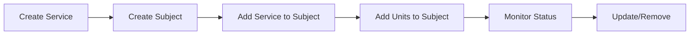

# AosCloud Platform Overview

## Introduction

**AosCloud** (AosEdge) is a cloud-edge computing platform designed for managing distributed services and edge units. The platform provides a RESTful API for orchestrating services across edge devices, enabling centralized management of automotive and IoT deployments.

### Key Characteristics

| Aspect | Description |
|--------|-------------|
| **Base URL** | `https://aoscloud.io:10000/api/v10/` |
| **API Style** | RESTful JSON API |
| **Primary Use** | Edge computing, IoT, automotive services |
| **Documentation** | Swagger UI available |

---

## Core Concepts

### Architecture Overview

```
┌─────────────────────────────────────────────────────────────────┐
│                        AosCloud Platform                        │
│                                                                  │
│  ┌─────────────┐    ┌─────────────┐    ┌─────────────┐        │
│  │   Service   │◀──▶│   Subject   │◀──▶│    Unit     │        │
│  │             │    │             │    │  (Device)   │        │
│  │  - UUID     │    │  - UUID     │    │  - UID      │        │
│  │  - Version  │    │  - Label    │    │  - Status   │        │
│  │  - Config   │    │  - Priority │    │  - Location │        │
│  └─────────────┘    └─────────────┘    └─────────────┘        │
│                                                                  │
│  ┌─────────────────────────────────────────────────────────┐   │
│  │              Azure Signing Integration                  │   │
│  │  Key Vault → Certificate → aos_signer → Signed Binary  │   │
│  └─────────────────────────────────────────────────────────┘   │
└─────────────────────────────────────────────────────────────────┘
```

### Entities

#### 1. Services
Services represent software applications, containers, or deployable artifacts that run on edge units.

**Properties:**
- `service_uuid` - Unique identifier for the service
- Version information
- Configuration metadata
- Deployment specifications

**Use Cases:**
- Deploy applications to edge devices
- Update service versions across multiple units
- Manage service lifecycle (start, stop, update)

#### 2. Units
Units represent physical or virtual edge devices (ECUs, gateways, IoT devices) that execute services.

**Properties:**
- `system_uid` - Unique device identifier
- Status and health information
- Hardware capabilities
- Network connectivity

**Use Cases:**
- Vehicle ECUs (Electronic Control Units)
- IoT gateways
- Edge servers
- Embedded devices

#### 3. Subjects
Subjects act as **binding entities** that connect Services to Units. They enable many-to-many relationships between services and devices.

**Properties:**
- `label` - Human-readable name
- `is_group` - Boolean flag for group management
- `priority` - Execution priority (0-based)

**Use Cases:**
- Group related services together
- Deploy multiple services as a package
- Manage device cohorts (fleet management)
- Roll out updates to specific groups

---

## Typical Workflows

### 1. Service Deployment Workflow



**Step-by-step:**

1. **Query Service** - Get latest service version and details
   ```bash
   GET /api/v10/services/{item_id}/
   ```

2. **Create Subject** - Create a binding entity
   ```bash
   POST /api/v10/subjects/
   {
     "label": "Production Fleet A",
     "is_group": true,
     "priority": 0
   }
   ```

3. **Link Service** - Attach service to subject
   ```bash
   POST /api/v10/subjects/{subject_id}/services/
   {
     "service_uuids": ["service-uuid"]
   }
   ```

4. **Assign Units** - Add target devices
   ```bash
   POST /api/v10/subjects/{subject_id}/units/
   {
     "system_uids": ["unit-uid-1", "unit-uid-2"]
   }
   ```

5. **Monitor** - Track deployment status
   ```bash
   GET /api/v10/units/{unit_id}/
   ```

### 2. Fleet Management Workflow

**Scenario:** Deploy an update to a subset of vehicles for testing

1. Create a "Canary Test" subject with `priority: 1`
2. Add the new service version
3. Add a small subset of units (5-10%)
4. Monitor for issues
5. If successful, promote to production subject with `priority: 0`
6. Roll out to remaining units

### 3. Certificate Signing Workflow

For secure deployments, services can be signed using Azure Key Vault integration:

```
┌─────────────┐     ┌─────────────┐     ┌─────────────┐
│   Binary    │────▶│ Azure Func  │────▶│ Key Vault   │
│   to Sign   │     │   (aos_signer)  │  │ (Certificate)│
└─────────────┘     └─────────────┘     └─────────────┘
       │                                         │
       ▼                                         ▼
┌─────────────┐                         ┌─────────────┐
│  Signed     │◀────────────────────────│  PFX Cert   │
│  Binary     │                         │  Stored     │
└─────────────┘                         └─────────────┘
```

---

## API Reference Summary

### Service Endpoints

| Method | Endpoint | Description |
|--------|----------|-------------|
| `GET` | `/api/v10/services/{id}/` | Get service info |
| `POST` | `/api/v10/subjects/{id}/services/` | Add service to subject |

### Subject Endpoints

| Method | Endpoint | Description |
|--------|----------|-------------|
| `POST` | `/api/v10/subjects/` | Create new subject |
| `POST` | `/api/v10/subjects/{id}/units/` | Add units to subject |

### Unit Endpoints

| Method | Endpoint | Description |
|--------|----------|-------------|
| `GET` | `/api/v10/units/{id}/` | Get unit status |
| `GET` | `/api/v10/units/{id}/subjects-services/{service_id}/` | Get detailed subject info |

---

## Security & Signing

### Certificate-Based Signing

The platform integrates with Azure Key Vault for secure code signing:

1. **Certificate Storage** - PFX certificates stored in Azure Key Vault
2. **Managed Identity** - Azure Functions use system-assigned identity
3. **Signing Tool** - `aos_signer` (Go-based signing utility)
4. **Workflow** - Binary → Azure Function → Signed Binary

### Security Considerations

| Concern | Mitigation |
|---------|------------|
| Unauthorized access | API authentication (tokens) |
| Code tampering | Certificate signing with aos_signer |
| Certificate exposure | Azure Key Vault with Managed Identity |
| Supply chain | Signed deployments only |

---

## Use Cases

### Automotive

| Scenario | Description |
|----------|-------------|
| **OTA Updates** | Push software updates to vehicle ECUs |
| **Fleet Management** | Group vehicles by region/model |
| **Service Bundles** | Deploy multiple related services together |
| **Canary Releases** | Test updates on subset of vehicles |

### IoT / Edge Computing

| Scenario | Description |
|----------|-------------|
| **Edge Gateway** | Deploy services to IoT gateways |
| **Remote Monitoring** | Query device status and health |
| **Configuration** | Update device configurations remotely |
| **Rolling Updates** | Update devices with zero downtime |

---

## Best Practices

### 1. Subject Organization
- Use descriptive `label` values for easy identification
- Leverage `priority` for deployment ordering
- Use `is_group: true` for fleet management

### 2. Service Versioning
- Always query service info before deployment
- Use semantic versioning
- Test in staging subjects before production

### 3. Error Handling
- Always check unit status after deployment
- Implement retry logic for failed deployments
- Use detailed subject info for debugging

### 4. Security
- Sign all production binaries
- Rotate certificates regularly
- Use Managed Identity instead of credentials

---

## Tools & Integration

### aos_signer
Go-based signing utility for code signing with Azure Key Vault certificates.

### Azure Function Integration
Serverless functions for:
- Retrieving certificates from Key Vault
- Signing binaries on-demand
- Automated CI/CD integration

---

## Related Documentation

- [AosEdge API Guide](./AosEdge_API_Guide.md) - Detailed API reference
- [Swagger UI](https://aoscloud.io:10000/) - Interactive API documentation
- [Azure Key Vault Docs](https://docs.microsoft.com/azure/key-vault/) - Certificate management

---

## Notes

- This platform appears to be proprietary with limited public documentation
- API version `v10` indicates mature platform evolution
- Port `10000` suggests non-standard HTTPS endpoint
- Integration with Azure services indicates enterprise-grade deployment
