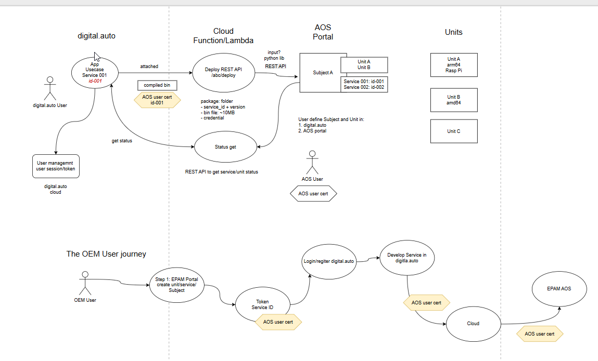

# AosEdge REST API & Azure Function Signing Guide

## REST API Overview

Base URL: `https://aoscloud.io:10000/api/v10/`



Full API documentation available at: **AosEdge REST API - Swagger UI**

---

## API Workflow: Connecting Units and Services via Subjects

### 1. Get Service Information
Retrieve info about a service, including the latest version.

**Endpoint:** `GET /api/v10/services/{item_id}/`

```bash
curl -X 'GET' \
  'https://aoscloud.io:10000/api/v10/services/222/' \
  -H 'accept: application/json'
```

---

### 2. Create Subject
A Subject joins Units and Services together.

**Endpoint:** `POST /api/v10/subjects/`

```bash
curl -X 'POST' \
  'https://aoscloud.io:10000/api/v10/subjects/' \
  -H 'accept: application/json' \
  -H 'Content-Type: application/json' \
  -d '{
  "label": "label for subject",
  "is_group": true,
  "priority": 0
}'
```

| Field | Type | Description |
|-------|------|-------------|
| `label` | string | Display name for the subject |
| `is_group` | boolean | Whether this is a group subject |
| `priority` | number | Priority level |

---

### 3. Add Service to Subject
Link one or more services to a subject.

**Endpoint:** `POST /api/v10/subjects/{item_id}/services/`

```bash
curl -X 'POST' \
  'https://aoscloud.io:10000/api/v10/subjects/3fa85f64-5717-4562-b3fc-2c963f66afa6/services/' \
  -H 'accept: application/json' \
  -H 'Content-Type: application/json' \
  -d '{
  "service_uuids": ["UID of service"]
}'
```

---

### 4. Add Unit to Subject
Link one or more units to a subject.

**Endpoint:** `POST /api/v10/subjects/{item_id}/units/`

```bash
curl -X 'POST' \
  'https://aoscloud.io:10000/api/v10/subjects/3fa85f64-5717-4562-b3fc-2c963f66afa6/units/' \
  -H 'accept: application/json' \
  -H 'Content-Type: application/json' \
  -d '{
  "system_uids": ["UID of unit"]
}'
```

---

### 5. Get Unit Status
Retrieve status of a Unit with all services and subjects it belongs to.

**Endpoint:** `GET /api/v10/units/{item_id}/`

```bash
curl -X 'GET' \
  'https://aoscloud.io:10000/api/v10/units/{item_id}/' \
  -H 'accept: application/json'
```

---

### 5.1. Get Detailed Subject Info on Unit
Get detailed information for a specific subject on the unit.

**Endpoint:** `GET /api/v10/units/{item_id}/subjects-services/{service_id}/`

```bash
curl -X 'GET' \
  'https://aoscloud.io:10000/api/v10/units/{item_id}/subjects-services/{service_id}/' \
  -H 'accept: application/json'
```

---

## Azure Function: Certificate Signing Integration

### Overview
Use Azure Functions to sign files/code using certificates stored in Azure Key Vault with the `aos_signer` tool.

---

### Step 1: Upload Certificate to Key Vault

Import your PFX certificate via Azure Portal or Azure CLI.

**Azure CLI:**
```bash
az keyvault certificate import \
  --vault-name <your-vault-name> \
  --name <cert-name> \
  --file client.pfx \
  --password <pfx-password>
```

---

### Step 2: Grant Azure Function Access

Enable a Managed Identity on your Azure Function and grant Key Vault access.

```bash
# Enable system-assigned managed identity
az functionapp identity assign --name <function-app-name> --resource-group <rg-name>

# Grant access using access policies
az keyvault set-policy \
  --name <your-vault-name> \
  --object-id <principal-id-from-above> \
  --secret-permissions get \
  --certificate-permissions get
```

**Alternatively, use RBAC:**
- Assign "Key Vault Secrets User" role
- Assign "Key Vault Certificate User" role

---

### Step 3: Use in Azure Function (Python)

```python
import azure.functions as func
from azure.identity import DefaultAzureCredential
from azure.keyvault.certificates import CertificateClient
from azure.keyvault.secrets import SecretClient
from aos_signer import aos_signer
import base64
import tempfile
import requests

def main(req: func.HttpRequest) -> func.HttpResponse:
    vault_url = "https://<your-vault-name>.vault.azure.net"
    credential = DefaultAzureCredential()

    # The full cert+key is stored as a secret with the same name
    secret_client = SecretClient(vault_url=vault_url, credential=credential)
    secret = secret_client.get_secret("<cert-name>")

    # Decode the PFX content
    pfx_bytes = base64.b64decode(secret.value)

    # Write to a temp file for use with aos-signer
    with tempfile.NamedTemporaryFile(suffix=".pfx", delete=False) as f:
        f.write(pfx_bytes)
        pfx_path = f.name

    # Place files in temp folder, sign and upload
    # ...
    aos_signer.run_go()
    # ...
```

---

## Architecture Summary

```
┌─────────────┐         ┌─────────────┐         ┌─────────────┐
│   Service   │────────▶│   Subject   │◀────────│    Unit     │
│             │         │             │         │             │
└─────────────┘         └─────────────┘         └─────────────┘
                              │
                              ▼
                       ┌─────────────┐
                       │ Azure Sign  │
                       │  Function   │
                       └─────────────┘
                              │
                              ▼
                       ┌─────────────┐
                       │ Key Vault   │
                       │ (Cert)      │
                       └─────────────┘
```
